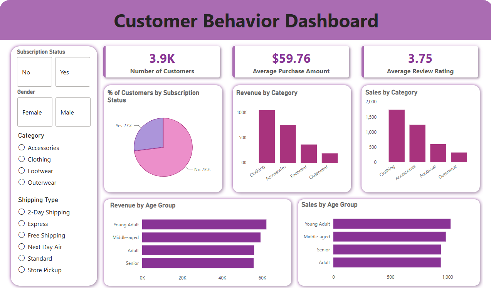

# 🛍️ Customer Behavior Analysis

An end-to-end Data Analytics project that analyzes retail customer shopping behavior to uncover purchasing trends, customer segments, and revenue drivers. The project demonstrates the complete analytics workflow—from data cleaning and exploration in Python, SQL analysis in MySQL, dashboard development in Power BI, to presenting business insights through a professional report and presentation.

---

## 📖 Project Overview

A retail company wants to better understand its customers' shopping behavior to improve customer engagement, optimize marketing strategies, and increase long-term profitability.

This project answers the business question:

> **"How can the company leverage consumer shopping data to identify trends, improve customer engagement, and optimize marketing and product strategies?"**

---

## 📂 Dataset

**Dataset:** Customer Shopping Behavior Dataset

**Dataset Summary**

- **Records:** 3,900
- **Features:** 18
- Customer Demographics
- Purchase Details
- Shopping Behavior
- Customer Reviews
- Discounts & Subscription Information

---

## 🛠️ Tools & Technologies

| Tool | Purpose |
|------|---------|
| **Python (Pandas, SQLAlchemy)** | Data cleaning, exploratory data analysis (EDA), feature engineering, and exporting the cleaned dataset to MySQL |
| **MySQL Workbench** | Business analysis, SQL querying, customer segmentation, and trend analysis |
| **Power BI** | Interactive dashboard development and data visualization |
| **Gamma** | Executive presentation and business storytelling |
| **Microsoft Word** | Business report |

---

## 📊 Project Workflow

### 1. Data Loading
- Imported the dataset into Python using Pandas.
- Performed initial data inspection and exploratory analysis.

### 2. Data Cleaning & Feature Engineering
- Checked missing values.
- Imputed missing review ratings using category median.
- Standardized column names.
- Created:
  - `age_group`
  - `purchase_frequency_days`
- Removed redundant columns.
- Exported the cleaned dataset to MySQL.

### 3. SQL Analysis
Performed business analysis using MySQL, including:

- Revenue by gender
- Discount effectiveness
- Highest-rated products
- Subscription spending analysis
- Customer segmentation
- Revenue by age group
- Top-performing products
- Shipping preference analysis

### 4. Dashboard Development
Built an interactive Power BI dashboard to visualize:

- Total Customers
- Average Purchase Amount
- Average Review Rating
- Revenue by Category
- Sales by Category
- Revenue by Age Group
- Sales by Age Group
- Subscription Distribution

Interactive filters include:

- Gender
- Subscription Status
- Category
- Shipping Type

<p align="center">
  
</p>

### 5. Business Reporting
Created:
- Professional project report
- Business presentation using Gamma

---

## 🔍 Key Findings

### 👥 Customer Demographics
- Male customers made up **68% of the customer base** (2,652 of 3,900), generating **$157,890 in revenue**
- Despite fewer numbers, **female customers spent more per purchase** ($60.25 vs. $59.48 avg), signaling a high-value segment worth targeting

### 💳 Subscription Behavior
- **73% of customers were non-subscribers**, contributing $170,436 in revenue
- Subscribed customers (27%) generated $62,645 with comparable avg spend ($59.49 vs. $59.87), indicating strong **untapped subscription growth potential**

### 🏷️ Discount Effectiveness
- **839 customers (21.5%)** used discounts while spending *above* the overall average purchase amount
- Proves that **strategic promotions drive higher-value purchases**, not just bargain hunting

### 🔁 Customer Loyalty
- **3,116 customers (79.9%) classified as loyal**, a strong retention base
- Highlights the critical importance of loyalty programs to protect and grow this majority segment

### 📊 Revenue by Age Group
- **Young Adults generated the highest revenue ($62,143)**
- Followed by Middle-aged customers ($59,197)
- These two segments are the **highest-priority targets** for marketing spend

### 🛍️ Product & Category Performance
- **Clothing** was the top-performing category with 1,737 sales, highest overall revenue
- **Footwear** received the highest avg category rating (3.79/5)
- Top-rated individual products: Gloves (3.86), Sandals (3.84), Boots (3.82)

### 🚚 Shipping Preferences
- **Express shipping customers spent more on average** ($60.48 vs. $58.46 Standard)
- Suggests a clear opportunity to **promote premium delivery** to high-value customers

---

## 💡 Business Recommendations

| # | Recommendation | Business Impact |
|---|---------------|-----------------|
| 1 | Introduce **tiered loyalty rewards** with exclusive benefits | Increase retention & customer lifetime value |
| 2 | Replace broad discounts with **targeted discount strategies** for price-sensitive segments | Improve promotion ROI |
| 3 | Focus campaigns on **Young Adults & Middle-aged** customers | Maximize revenue from highest-value segments |
| 4 | Promote **Clothing & top-rated Footwear** products | Drive sales in proven high-performing categories |
| 5 | Encourage **Express Shipping** with value-added delivery perks for high spenders | Increase avg order value & premium experience |

---

## 📁 Repository Structure

```
Customer-Behavior-Analysis/
│
├── Problem/
│   └── Business Problem Document.pdf
|
├── Dataset/
│   └── customer_shopping_behavior.csv
│
├── Python/
│   └── customer_behavior_analysis.ipynb
│
├── SQL/
│   └── customer_behavior_analysis.sql
│
├── PowerBI/
│   └── Customer_Behavior_Dashboard.pbix
│
├── Report/
│   └── Customer_Behavior_Analysis_Report.pdf
│
├── Presentation/
│   └── Customer_Behavior_Analysis_Presentation.pdf
|
├── Assets/
│   └── dashboard.png
|
└── README.md
```

---

## ▶️ How to Run

1. Clone this repository.
2. Open the Python notebook and install the required libraries.
3. Run the data cleaning and preprocessing steps.
4. Export the cleaned dataset to MySQL.
5. Execute the SQL queries in MySQL Workbench.
6. Open the Power BI (`.pbix`) file to explore the interactive dashboard.
7. Review the project report and presentation for business insights.

---

## 🎯 Project Outcomes

This project demonstrates practical skills in:

- Data Cleaning
- Exploratory Data Analysis (EDA)
- Feature Engineering
- SQL Querying
- Business Intelligence
- Dashboard Design
- Data Storytelling
- Business Recommendations

---

## 👤 Author

**Adhya Rastogi**

MBA in Business Analytics | Data Analytics | Business Intelligence

**LinkedIn:** https://www.linkedin.com/in/adhyarastogi/
